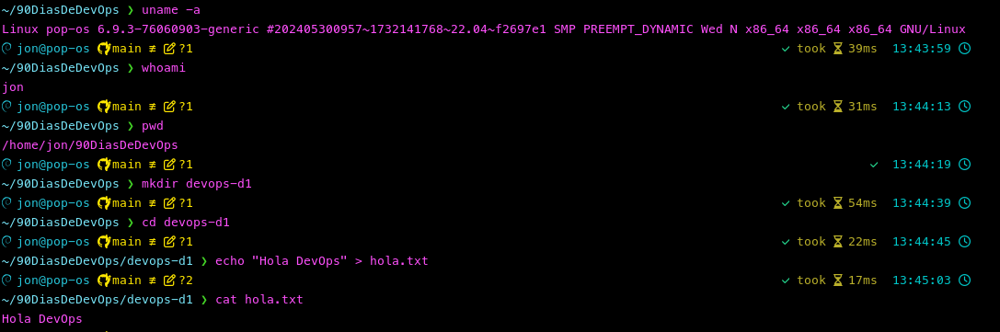
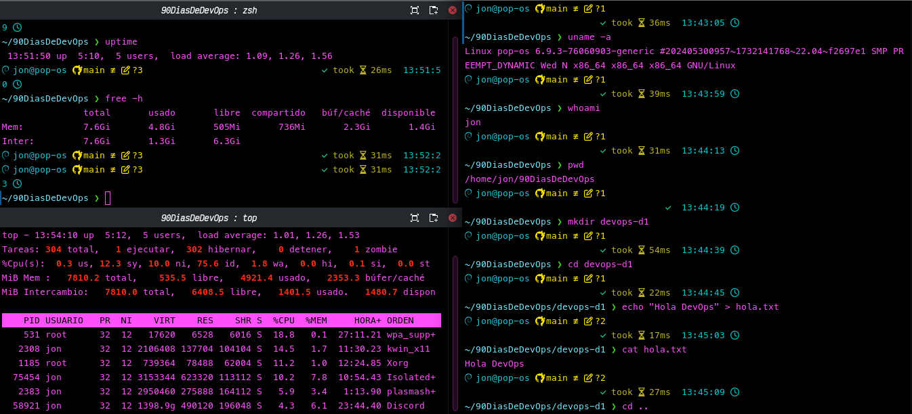

# Dia 1/90
## Que es DevOps❔
 Es la colaboracion de los equipos de desarrollo y operaciones que nos permite colaborar, compartir y automatizar las tareas repetitivas.
 DevOps es una cultura que busca las mejores practicas en desarrollo de software y en las operaciones para su despliegue.

 ## 🛠️Herramientas

| Herramientas conocidas | Herramientas nuevas |
| :--- | :--- |
| Git | Prometheus |
| GitHub | Grafana |
| Docker | ArgoCD |
| Kubernetes | Pulumi |
| Jenkins |  |
| OpenShift |  |
| Terraform |  |

## 🖥️Comandos de Linux

Muestra que OS tenemos, version del fireware y la arquitectura
```
uname -a
```
Muestra el usuario con el que ingresamos
```
whoami
```
Nos indica en que directorio estamos ubicados en ese instante
```
pwd
```
Muestra en el contenido en formato largo, los directorios ocultos y en formato legible para el humano
```
ls -lah
```
Creamos un directorio
```
mkdir devops-d1
```
Nos dirigimos al directorio
```
cd devops-d1
```
Nos permite asignar el contenido a un fichero
```
echo "Hola DevOps" > hola.txt
```
Mostrar el contenido del fichero
```
cat hola.txt
```

## 🎯Desafio
__¿Cuánto tiempo lleva encendido tu sistema?__
    up 5 hours, 56 minutes
__¿Qué procesos están consumiendo más recursos?__
    Discord, Firefox
__¿Cuánta memoria disponible tenés?__
    459Mi
### Ejecucion



# Dia 2/90

# 🖥️Comandos

Muestra el usuario con el que ingreso.
```
whoami
```

Muestra el directorio donde se encuentra en ese momento.
```
pwd
```

Muestra una lista de los ficheros y directorios del directorio de donde se ejecuto el comando, con el formato que lo muestra todo, muestra los directorios ocultos y en formato que sea legible para los humanos. 
```
ls -lah
```

Muestra en una lista todas las particiones, en formato que sea legible para los humanos y el tipo de particion. 
```
df -hT
```

Muestra la hora actual, hace cuanto fue encendido el equipo, los usuarios y el promedio de encendido.
```
uptime
```

Nos cambia de directorio actual al directorio __/__ (raiz)
```
cd /
```

Muestra en una lista los ficheros y directorios del directorio donde se encuentra. Solo muestra los nombres no es como el anterior comando que mostraba mas caracteristicas.
```
ls
```

Es la combinacion de los dos comandos previos, nos cambiamos al directorio __/etc__ y mostramos los ficheros y directorios de __/etc__.
```
cd /etc && ls
```

Hace lo mismo que el comando anterior solo que en esta ocacion nos dirigimos al directorio __/home__ y mostramos los ficheros y directorios de __/home__.
```
cd /home && ls
```

### 🎯Reto de comprension

__¿Qué hace este comando?__
```
chmod u=rwx,g=rx,o= hola.txt
```

Le esta cambiando los permisos:
- Al __usuario__ le esta dando todos los permisos: lectura, escritura y ejecucion.
- Al __grupo__ le da los permisos de lectura y ejecucion.
- A __otros__ no le da ningun permiso.

# Dia 3/90

## Vagrant
Vagrant nos ayuda al aprovisionamiento de VM para realizar nuestros laboratorios
facilitando el despliegue de nuestra arquitectura y las dependencias que son 
requeridas para nuestro laboratorio.

### Posibles errores
1. Uno de los posibles errors es que no tengamos habilitado VM en la Bios.
   __Solucion__: Entrar a la Bios y habilitar la VM
2. Es el rango de las IP
   __Solucion__: Cambiar el rango de IP

# Dia 4/90

## Git y GitHub

Vamos a realizar los ejercicios de la pagina.

### Ejercicio 1
Lo que vimos fue la creacion de un repositorio y subirlo a la plataforma GitHub.
Como estoy utilizando SSH para conectarme debo ejecutar previamente los comandos:
```
eval "$(ssh-agent -s)"
ssh-add ~/.ssh/id_MI_LLAVE_PRIVADA
```

id_MI_LLAVE_PRIVADA es la que crea para poder conectarme a la plataforma GitHub.

### Ejercicio 2
Realizamos un __fork__ al repositorio de Roxs y los sincronizamos.
Nos creamos una rama y agregamos un fichero luego lo comiteamos y finalmente
le hicimos un merge en la rama main y borramos la rama tanto en local como de la
plataforma.

#### Reset
Agrege un fichero y lo comitie, y realice la eliminacion tanto del commit y manteniendo los cambios,
y tambien la eliminacion del commit y descartar los cambios. El primero solo elimina el commit y el
fichero con los cambios lo seguimos teniendo en el __workdirectory__. En el segundo escenario se 
elimina el commit y nos cambia al commit previo, y quita los ficheros del __workdirectory__ (los elimina
esto porque en el commit previo no estaban esos ficheros).

#### Revert
Agrege un fichero por commit realice un __revert__ en donde al ejecurar este comando se mantienen los
cambios pero se borra lo que se tenia en ese commit al que retornanmos, es decir, en este commit yo 
tengo un fichero que se agrego y despues realice dos commit y en cada commit agrege un fichero, y 
lo que hace el comando __revert__ es volver a ese commit pero sin el cambio de ese commit y se mantiene 
los ficheros de los otros dos commit.
En otras palabras los ficheros, directorios que se tenian en ese commit ya no van a estar.

#### Rebase
Me cambie a la rama __feature-branch__ en donde tengo solo un cambio (un fichero nuevo) y ejecute el
comando __rebase__, lo que hace este comando traer todo el historial de main a la rama __feature-branch__.

#### Pull Request
Cree un __PRs__ desde la terminal agrege la herramiente __GitHub CLI__ para poder crear Issue, PRs.
Lo que hice fue cambiar de rama __feature-branch__ y cree el ficheros y los subi al repositorio
luego cree un __PRs__ desde la terminal y luego me cambie a la rama __main__ en donde actualice la rama
main y finalmente ejecute el __merge__ y de esta forma se cierra el PRs.

#### Resolucion de conflictos
Creamos un nuevo repositorio local, en donde creamos un fichero en la rama __main__ y movemos al area
de stage, luego creamos otra rama __feature_branch__ en donde modificamos el fichero y lo movemos al area
de stage, ahora nos cambiamos a la rama __main__ y modificamos el fichero y lo movemos al area de stage.
Y ahora realizamos un __merge__ de la rama __feature_branch__ en donde vamos a tener un conflicto ya que en 
ambas ramas tenemos modificada la misma linea, lo que debemos hacer es aceptar el cambio de __main__ o de 
__feature_branch__, incluso podemos mantener ambos eso lo definira el desarrolador.

#### Git Stash
Lo que realiza este comando es si realizamos cambios dentro de nuestro proyecto y ejecutamos este 
comando lo que hace es que todos los cambios los guarda en una __pila__ y deja el area de trabajo 
sin eso cambios, ahora para volver a tener los cambios que estan en la pila se debe agregar el flag
__pop__ este saca el ultimo cambio que se le agrego a la __pila__.

#### Tags de Version
Se ejecuto el comando __tag__ y se pudo apreciar que lo que hace es comprimir todo el repositorio en formato .zip y .tar.gz
Eso si ya no tiene el historial (.git).

#### Editar commits pasados
El primer comando __--amend -n__ cambia el ultimo commit. Debemos tener en cuenta si este ya fue pusheado debemos forzar el push para que se actualice en GitHub.

El segundo comando __rebase -i HEAD~3__ lo que hace este comando es abrir el editor y debemos reemplazar pick por: reword, edit, squash, drop.