# Dia 15/90
Para este proyecto practicamos crear un proyecto de GitHub con el cliente _gh_. \

## Crear repositorio
```
gh repo create
```
Luego de ejecutar el comando debemos contestar las preguntas que nos apareceran ya \
que estos son los mismos campos que llenamos cuando lo creamos desde la interfaz web. \

```
? What would you like to do? Create a new repository on github.com from scratch
? Repository name mi-primer-ci-cd
? Description Creando mi primer GitHub Actions
? Visibility Public
? Would you like to add a README file? No
? Would you like to add a .gitignore? Yes
? Choose a .gitignore template AL
? Would you like to add a license? Yes
? Choose a license Apache License 2.0
? This will create "mi-primer-ci-cd" as a public repository on github.com. Continue? Yes
✓ Created repository jorhak/mi-primer-ci-cd on github.com
  https://github.com/jorhak/mi-primer-ci-cd
? Clone the new repository locally? No
```

Ahora lo que vamos hacer sera clonar este repositorio para trabajar sobre el. \
Debemos estar ubicados en la ruta **semana-03/ejercicios/ejercicio-01**
```
git clone git@github.com:jorhak/mi-primer-ci-cd.git
cd mi-primer-ci-cd
```

## Crear Pipelines
### Pipeline Basico
```
mkdir -p .github/workflows
touch .github/workflows/basico.yml
```

Agregamos las siguientes lineas \
basico.yml \
```
name: Workflow basico

on:
  push:
    branches: [ main ]
  pull_request:
    branches: [ main ]
  workflow_dispatch:

jobs:
  verificar_repositorio:
    runs-on: ubuntu-latest
    steps:
    - name: 📥 Verificar repositorio
      uses: actions/checkout@v4
    
    - name: Imprimir saludo
      run: |
        echo "¡Hola desde el workflow básico! 🚀"
        whoami
        cat /etc/os-release

    - name: 🧪 Test Sencillo
      run: |
        cat /etc/passwd
```

Ahora debemos agregarlo workspace, luego al stage y finalmente push para que se suba al repositorio remoto \ 
y que se ejecute el Pipeline
```
ga .
gc "Agregando Pipeline basico"
gp
```

Cabe mencionar que utilice alias. \

### Pipeline con variables
```
touch .github/workflows/con_variables.yml
```

Agregamos las siguientes lineas \
con_variables.yml
```
name: Agregando variables

on: 
  push:
    branches: [ main ]
  pull_request:
    branches: [ main ]
  workflow_dispatch:

env:
  VALOR1: "4"
  VALOR2: "6"
  OPERACION: "suma"

jobs:
    checkout:
      runs-on: ubuntu-latest
      steps:
      - name: 📥 Descargar código
        uses: actions/checkout@v4
     
      - name: Realizar operación
        run: |
          if [ "$OPERACION" == "suma" ]; then
            RESULTADO=$((VALOR1 + VALOR2))
            echo "La suma de $VALOR1 y $VALOR2 es: $RESULTADO"
          fi
```

Ahora debemos agregarlo workspace, luego al stage y finalmente push para que se suba al repositorio remoto \ 
y que se ejecute el Pipeline

```
ga .
gc "Agregando Pipeline con variables"
gp
```

### Pipeline segun rama

#### Requisitos previos
a) Contar con un webhook en Discord
   1. Abrimos nuestro Discord, nos dirigimos a la parte inferior izquierda y damos click sobre ➕ \
   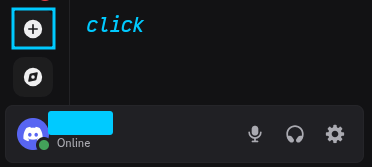
   2. Damos click sobre Create My Own. \
   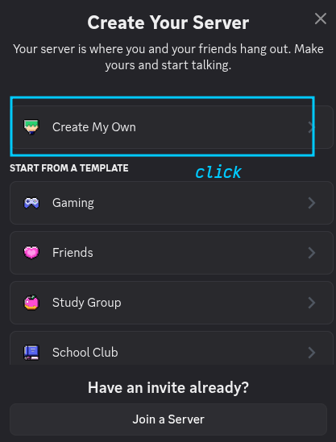
   3. Elegimos para quien va ser el Server, damos click sobre For me and my friends. \
   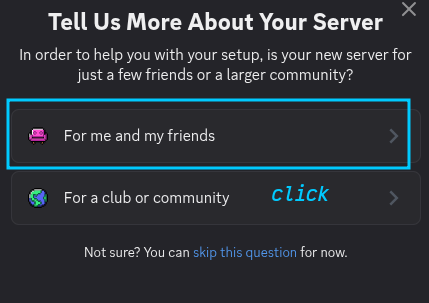
   4. Le asignamos un nombre y damos click en Create. \
   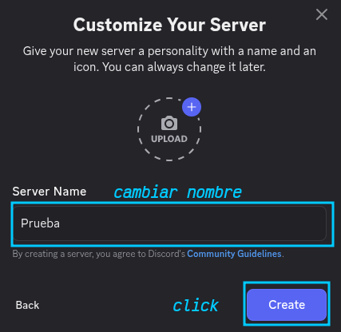
   5. Una ves se cree nuestro Server damos click sobre Prueba y en la parte superior izquierda del canal \
   general damos click sobre ⚙️ \
   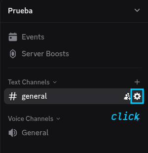
   6. Nos vamos a Integration y luego damos click sobre Create Webhook \
   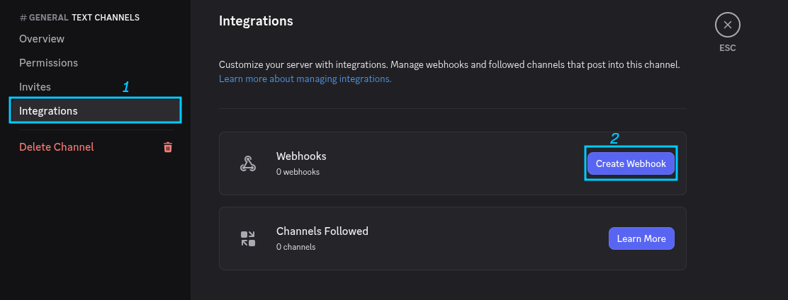
   7. Damos click en Create Webhook. \
   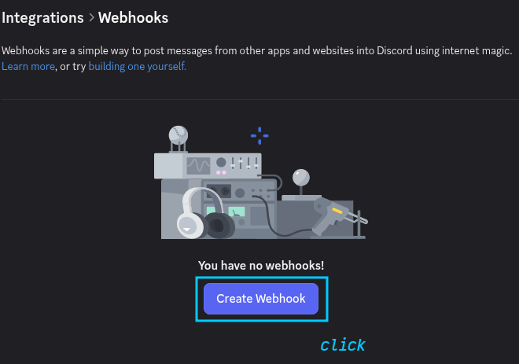
   8. Ya tenemos nuestro Webhook creado lo que debemos hacer es copiar la URL del webhook que va ser nuestro \
   **secrets** en GitHub. \
   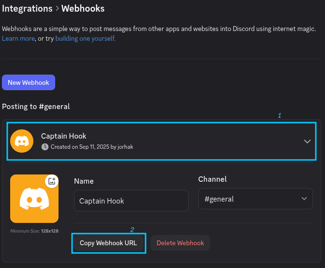

b) Contar con un webhook en Slack \
   Antes debemos crearnos un WorkSpace.
   1. Para comenzar nos dirigimos a [API Slack](https://docs.slack.dev/messaging/sending-messages-using-incoming-webhooks/). Damos click en Create an app. \
   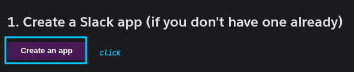
   2. Se nos va abrir otra pestana y damos click en Create an App. \
   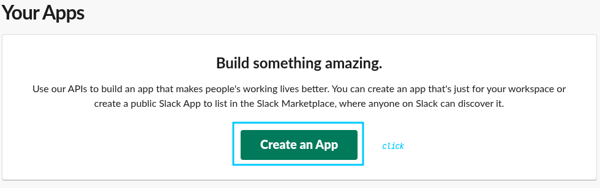
   3. Nos va pedir elegir si usamos un manifiesto o si lo queremos desde cero, vamos a dar click
   sobre From scratch. \
   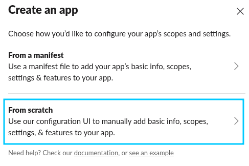
   4. Le asignamos un nombre, elegimos el workspace y finalmente damos click en Create App. \
   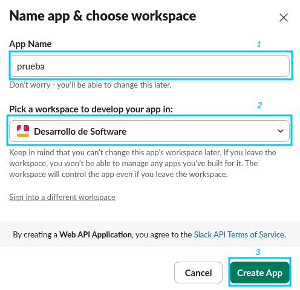
   5. Cuando se nos cree la aplicacion nos vamos a la parte superior izquierda y damos click sobre Incoming Webhooks. \
   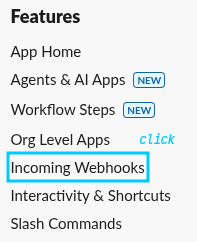
   6. Habilitamos Incoming webhook. \
   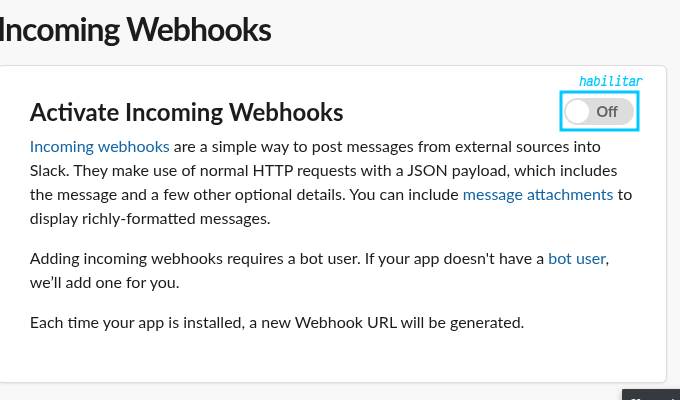
   7. Vamos agregar un nuevo webhook. \
   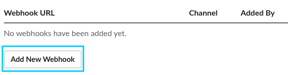
   8. Ya tenemos nuestro Webhook creado lo que debemos hacer es copiar la URL del webhook que va ser \
   nuestro **secrets** en GitHub. \
   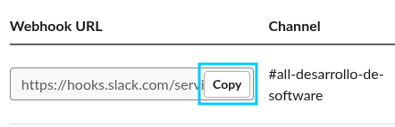


### Crear Pipeline
```
touch .github/workflows/con_condicion.yml
```

Agregamos las siguientes lineas \
con_condicion.yml
```
name: Ejecutar segun la rama

on:
  push:
    branches: [main, develop, feature/*]
  workflow_dispatch:

jobs:
    checkout:
      runs-on: ubuntu-latest
      steps:
      - name: Revisar codigo
        uses: actions/checkout@v4

    rama:
      runs-on: ubuntu-latest
      steps:
      - name: Revisar codigo
        uses: actions/checkout@v4
        
      - name: notificar discord (solo main)
        if: github.ref == 'refs/heads/main'
        run: |
          curl -H "Content-Type: application/json" -X POST -d '{"content":"🚀 El código se ha actualizado en la rama main."}' ${{ secrets.DISCORD_WEBHOOK_URL }}

      - name: Enviar correo (en develop y feature/*) 📧
        if: github.ref == 'refs/heads/develop' || startsWith(github.ref, 'refs/heads/feature/')
        run: |
          curl -X POST -H 'Content-type: application/json' --data '{"text":"Nuevo commit de ${{ github.event.head_commit.author.name }}: commit: ${{ github.event.head_commit.message }}"}' ${{ secrets.SLACK_WEBHOOK_URL }}
```

Ahora debemos agregarlo al workspace, luego al stage y finalmente push para que se suba al repositorio \
remoto y que se ejecute el Pipeline

```
ga .
gc "Agregando Pipeline segun rama"
gp
```

### Crear rama develop y subirlo al repositorio
```
git checkout -b develop
git branch develop
git push origin develop
```

Ahora segun la rama se ejecuta la notificacion que para main va a Discord y para develop y feature va a Slack.

# Dia 16/90
No llegaba a importar el modulo "app". Esto se debe a que al momento de ejecutar **pytest** este busca tests/ \
y este no sabe que debe "subir un nivel".
Lo que vamos hacer sera crear un fichero dentro de tests/__init__.py para que este directorio se reconosca como un paquete del cual pueden importar modulos. \
Tuvimos un problema con los response ya que no imprimia el caracter "¡" sino que imprimia "\u00a1" por lo que \
un test no llega a pasar. \

Aqui cometi un error, bueno no se si fue un error pero lo estaba subiendo todo al repositorio de 90DiasDeDevOps.
Asi que me cree otro para subir mi-app-python/ a otro repositorio. \
Cree el repositorio con **gh** como cree el repositorio en el dia 15. Aqui le agrege .gitignore por lo cual \
ya tenia un commit. \
Ahora lo que tengo que hacer es inicializar repositorio y agregarlo al que acabo de crear. \
Lo que tenia que hacer era que el contenido del repositorio remoto este en mi respositorio local y para ello \
se ejecutan los siguientes comandos. \

```
git init 
git remote add origin git@github.com:jorhak/mi-app-python.git
git pull origin main
ga .
gc " Build y Test basico"
gp
git push --set-upstream origin main
```

## Reto
### Estructura de directorios

```
├── pytest.ini
├── requirements.txt
├── src
│   ├── app.py
│   └── __pycache__
└── tests
    ├── __pycache__
    └── test_api.py
```

### Creacion de directorios
```
mkdir retoFlask && cd retoFlask
mkdir [src,tests] && cd tests
touch test_api.py
```

### Agregar codigo para los tests
```
import pytest
from app import app
from app import (
    get_deudas, get_saldo, realizar_pago, cancelar_pago,
    oauth_token, deudas_data, saldo_data, pagos
)
from datetime import datetime, timedelta

@pytest.fixture
def client():
    app.config['TESTING'] = True
    with app.test_client() as client:
        # Resetear los datos para cada test para asegurar la independencia
        deudas_data.clear()
        deudas_data.update({
            '12345': [{"monto": 100, "mes": "Mayo"}, {"monto": 150, "mes": "Junio"}],
            '1425': [{"monto": 250, "mes": "Julio"}]
        })
        saldo_data.clear()
        saldo_data.update({'12345': 200, '1425': 500})
        pagos.clear()
        yield client

def get_token(client):
    """Función auxiliar para obtener un token de autenticación."""
    response = client.post('/oauth/token')
    return response.get_json()['token']

## Test 1: Generar OAuth Token
def test_1_oauth_token_generation(client):
    response = client.post('/oauth/token')
    data = response.get_json()
    assert response.status_code == 200
    assert 'token' in data
    assert 'created_at' in data
    assert 'expires_at' in data
    assert 'id' in data

## Test 2: Obtener Deudas
def test_2_get_deudas_success(client):
    """Test para consultar deudas con un identificador válido y el formato correcto."""
    token = get_token(client)
    headers = {'Authorization': f'Bearer {token}'}
    response = client.get('/deudas?codigo=ci@12345', headers=headers)
    assert response.status_code == 200
    assert "deudas" in response.get_json()
    assert len(response.get_json()["deudas"]) > 0

## Test 3: Obtener Saldo
def test_3_get_saldo_success(client):
    """Test para consultar el saldo con un token válido."""
    token = get_token(client)
    headers = {'Authorization': f'Bearer {token}'}
    response = client.get('/saldo', headers=headers)
    assert response.status_code == 200
    assert "saldo" in response.get_json()

## Test 4: Pago Exitoso
def test_4_realizar_pago_success(client):
    """Test para realizar un pago exitoso cuando el saldo es suficiente."""
    token = get_token(client)
    headers = {'Authorization': f'Bearer {token}'}
    response_pago = client.post('/pagar?codigo=ci@12345', headers=headers)
    assert response_pago.status_code == 200
    assert "pago_id" in response_pago.get_json()
    assert response_pago.get_json()["mensaje"] == "Pago realizado con éxito."
    assert saldo_data['12345'] == 100 # Saldo inicial 200 - deuda 100

## Test 5: Pago con Fondos Insuficientes
def test_5_realizar_pago_insufficient_funds(client):
    """Test para verificar que el pago falla con un mensaje de error si el saldo es insuficiente."""
    token = get_token(client)
    headers = {'Authorization': f'Bearer {token}'}
    # Forzar un saldo bajo para el test
    saldo_data['12345'] = 50
    # La URL ha cambiado para usar 'codigo'
    response_pago = client.post('/pagar?codigo=ci@12345', headers=headers)
    assert response_pago.status_code == 400
    assert response_pago.get_json()["error"] == "Saldo insuficiente para cubrir la deuda."

## Test 6: Cancelar Pago dentro del Límite de Tiempo
def test_6_cancelar_pago_within_time_limit(client):
    """Test para cancelar un pago dentro del límite de 5 minutos."""
    token = get_token(client)
    headers = {'Authorization': f'Bearer {token}'}
    # Realizar el pago 
    response_pago = client.post('/pagar?codigo=ci@12345', headers=headers)
    pago_id = response_pago.get_json()['pago_id']
    # Cancelar el pago
    response_cancelacion = client.delete(f'/cancelar/{pago_id}?codigo=ci@12345', headers=headers)
    assert response_cancelacion.status_code == 200
    assert response_cancelacion.get_json()["mensaje"] == "Pago cancelado exitosamente."
    assert len(deudas_data['12345']) == 2 # La deuda debe ser devuelta
    assert saldo_data['12345'] == 200 # El saldo debe ser restaurado
```

### Mover a directorio src
```
cd ../src
touch app.py
```

### Codigo
```
from flask import Flask, request, jsonify
from datetime import datetime, timedelta
import uuid

# Inicialización de la aplicación
app = Flask(__name__)

# Simulación de una base de datos en memoria
usuarios = {}
pagos = {}
deudas_data = {
    '12345': [{"monto": 100, "mes": "Mayo"}, {"monto": 150, "mes": "Junio"}],
    '1425': [{"monto": 250, "mes": "Julio"}]
}
saldo_data = {'12345': 20, '1425': 500}

# Decorador para la autenticación OAuth
def require_oauth_token(f):
    # ... (mismo código) ...
    def wrapper(*args, **kwargs):
        auth_header = request.headers.get('Authorization')
        if not auth_header or not auth_header.startswith('Bearer '):
            return jsonify({"error": "Token de autenticación es requerido."}), 401
        
        token = auth_header.split(' ')[1]
        
        if token not in usuarios or datetime.fromisoformat(usuarios[token]['expires_at']) < datetime.now():
            return jsonify({"error": "Token inválido o expirado."}), 401
            
        return f(*args, **kwargs)
    wrapper.__name__ = f.__name__
    return wrapper

# Nueva función para parsear los parámetros personalizados
def parse_custom_params(param_string):
    """
    Parsea una cadena con el formato 'key@value$key@value'.
    Retorna un diccionario de los parámetros.
    """
    parsed = {}
    if not param_string:
        return parsed
        
    parts = param_string.split('$')
    for part in parts:
        key_value = part.split('@')
        if len(key_value) == 2:
            key, value = key_value
            parsed[key] = value
        else:
            # Puedes manejar este error de forma más robusta si lo deseas
            return None
    return parsed

# Endpoint para la generación de token OAuth
@app.route('/oauth/token', methods=['POST'])
def oauth_token():
    # ... (mismo código) ...
    token = str(uuid.uuid4())
    created_at = datetime.now()
    expires_at = created_at + timedelta(minutes=30)
    
    user_id = str(uuid.uuid4())
    usuarios[token] = {
        'token': token,
        'created_at': created_at.isoformat(),
        'expires_at': expires_at.isoformat(),
        'id': user_id
    }
    
    return jsonify(usuarios[token]), 200

# Endpoint para consultar deudas
@app.route('/deudas', methods=['GET'])
@require_oauth_token
def get_deudas():
    # Accede al parámetro 'codigo' del query string
    param_string = request.args.get('codigo')
    params = parse_custom_params(param_string)
    
    if not params:
        return jsonify({"error": "Formato de parámetros de URL inválido o no proporcionado."}), 400
        
    deudas_encontradas = []
    
    for key, value in params.items():
        if value in deudas_data:
            deudas_encontradas.extend(deudas_data[value])
            
    if not deudas_encontradas:
        return jsonify({"mensaje": "No se encontraron deudas para los identificadores proporcionados."}), 404
    
    return jsonify({"deudas": deudas_encontradas}), 200

# Endpoint para consultar saldo
@app.route('/saldo', methods=['GET'])
@require_oauth_token
def get_saldo():
    # ... (mismo código, sin cambios ya que no usa parámetros de esta manera) ...
    identificador_usuario = '12345'
    saldo_actual = saldo_data.get(identificador_usuario)

    if saldo_actual is None:
        return jsonify({"error": "Saldo no disponible para este usuario."}), 404
    
    return jsonify({"saldo": saldo_actual}), 200

# Endpoint para realizar el pago
@app.route('/pagar', methods=['POST'])
@require_oauth_token
def realizar_pago():
    # Accede al parámetro 'codigo' para obtener el identificador
    param_string = request.args.get('codigo')
    params = parse_custom_params(param_string)
    
    if not params or not 'ci' in params:
        return jsonify({"error": "El identificador del cliente (ci) es requerido para el pago."}), 400
    
    identificador_usuario = params['ci']
    
    saldo_actual = saldo_data.get(identificador_usuario, 0)
    deudas_usuario = deudas_data.get(identificador_usuario, [])
    
    if not deudas_usuario:
        return jsonify({"error": "No tienes deudas pendientes."}), 400
        
    primera_deuda = deudas_usuario[0]
    monto_deuda = primera_deuda['monto']
    print("Saldo actual:", saldo_actual, "Monto deuda:", monto_deuda)
    if saldo_actual < monto_deuda:
        return jsonify({"error": "Saldo insuficiente para cubrir la deuda."}), 400
    else:
        pago_id = str(uuid.uuid4())
        pagos[pago_id] = {
            'monto': monto_deuda,
            'deuda_pagada': primera_deuda,
            'timestamp': datetime.now(),
            'ci': identificador_usuario
        }
        
        saldo_data[identificador_usuario] -= monto_deuda
        deudas_data[identificador_usuario].pop(0)
        
        return jsonify({
            "pago_id": pago_id,
            "mensaje": "Pago realizado con éxito.",
            "saldo_restante": saldo_data[identificador_usuario]
        }), 200

# Endpoint para cancelar el pago
@app.route('/cancelar/<pago_id>', methods=['DELETE'])
@require_oauth_token
def cancelar_pago(pago_id):
    if pago_id not in pagos:
        return jsonify({"error": "ID de pago no encontrado."}), 404
    
    param_string = request.args.get('codigo')
    params = parse_custom_params(param_string)

    if not params or not 'ci' in params:
        return jsonify({"error": "El identificador del cliente (ci) es requerido para cancelar el pago."}), 400

    pago = pagos[pago_id]
    identificador_usuario = params['ci']
    
    if identificador_usuario != pago['ci']:
        return jsonify({"error": "El pago no corresponde al identificador de cliente proporcionado."}), 403

    tiempo_transcurrido = datetime.now() - pago['timestamp']
    
    if tiempo_transcurrido > timedelta(minutes=5):
        return jsonify({"error": "El tiempo límite de 5 minutos para cancelar el pago ha expirado."}), 400
        
    saldo_data[identificador_usuario] += pago['monto']
    deudas_data[identificador_usuario].insert(0, pago['deuda_pagada'])
    del pagos[pago_id]
    
    return jsonify({"mensaje": "Pago cancelado exitosamente."}), 200

if __name__ == '__main__':
    app.run(debug=True)
```

### Requerimientos para la aplicacion
```
cd ..
nano requirements.txt
```

```
Flask==2.3.3
Flask-Testing==0.8.1
Flask-OAuthlib==0.9.5
pytest==7.4.2
```

### Directorio que utilizan los tests, importacion de modulos
```
nano pytest.ini 
```

```
[pytest]
pythonpath = src
```

### Probar tests y codigo en local
```
python -m venv env
source env/bin/activate
pip install -r requirements.txt
pytest
python src/app.py
```

## Clonar repositorio
```
git clone https://github.com/jorhak/retoFlask.git
cd retoFlask
```

Y ejecutamos los comandos previos **Probar tests y codigo en local**.

## GitHub Actions
```
mkdir -p .github/workflows
touch .github/workflows/ci-python.yml
```

```
name: Mi Pipeline con matrix

on:
  push:
    branches: [main]
  pull_request:
    branches: [main]

jobs:
  test-con-matrix:
    runs-on: ubuntu-latest
    strategy:
      matrix:
        python-version: ['3.7', '3.8', '3.9']
    
    steps:
    - uses: actions/checkout@v4

    - uses: actions/setup-python@v4
      with:
        python-version: ${{matrix.python-version}}

    - run: pip install -r requirements.txt
    - run: pytest

    - name: Fetch Postman Collection
      uses: stcalica/postman-publish-action@master
        with:
          postman_api_key: ${{ secrets.POSTMAN_KEY }}
          collection_id: ${{ vars.COLLECTION_ID }}
```

